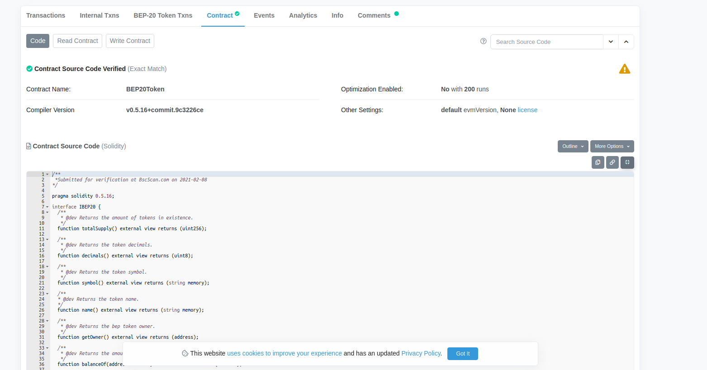
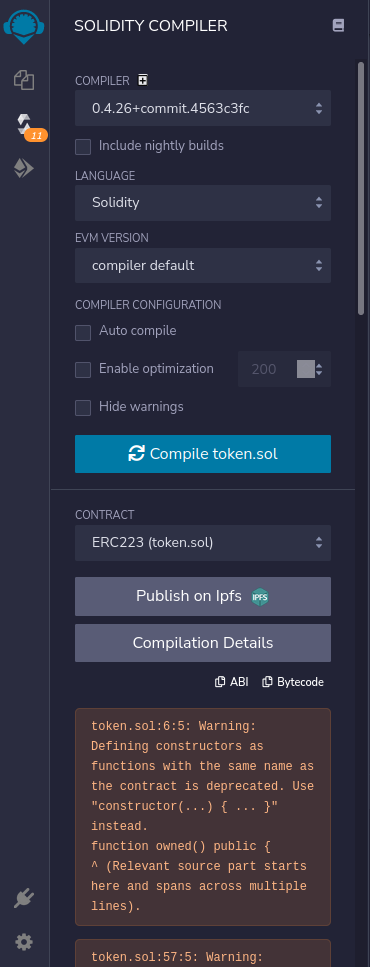
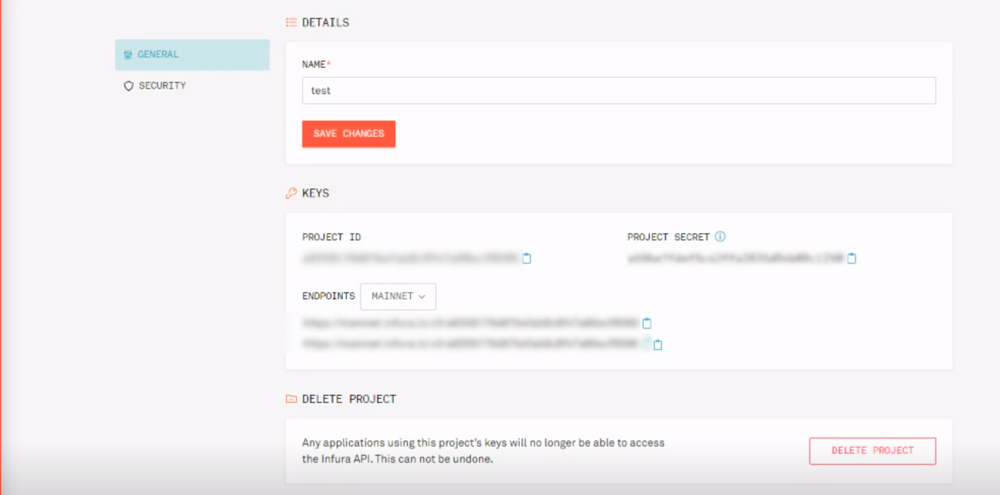

# Blockchain deployment

## 1. To check Our smart contracts

You can check all our different smart contracts on etherscan for ERC20 and bscan for BEP20:

-   For ethereum network please visit this [link](https://etherscan.io/address/0xdf49c9f599a0a9049d97cff34d0c30e468987389#code) and you can find in **Contract** tab the code in Solidity.

-   For Binance network please visit this [link](https://bscscan.com/address/0x448bee2d93be708b54ee6353a7cc35c4933f1156#code) and you can find in **Contract** tab the code in Solidity.



## 2. To Deploy smart contracts (token,campaign and oracle) in contract folder with [Remix](https://remix.ethereum.org) and [Metamask](https://metamask.io/) or [MEW](https://www.myetherwallet.com/)

### a. create your file on Remix and paste your code there


### b. Compile your file.sol and check



### c. To deploy your smart contract you should connect with your metamask account


## 2. To create node, Web3 service provider with [Geth](https://geth.ethereum.org/),[openethereum](https://github.com/openethereum/openethereum) or [Infura](https://infura.io/) SaaS

### a. Create new Ethereum app


### b. Get node credentials from infura such as PROJECTID, PROJECT SECRET, and the endpoints that we can use to connect to infura node (https, wss)



PS: This credential refers to in WEB3_URL .env file

```sh
WEB3_URL=process.env.WEB3_URL
```

You can also install Geth Node and follow this [Guide](https://geth.ethereum.org/docs/getting-started) or [Parity](https://openethereum.github.io/Setup)

## 4. on campaign contract call modToken(<token_address>,true)

## 5. on campaign contract call setOracle(<oracle_address>)

## 6. on oracle contract call changeAsk(<campaign_address>,true)
