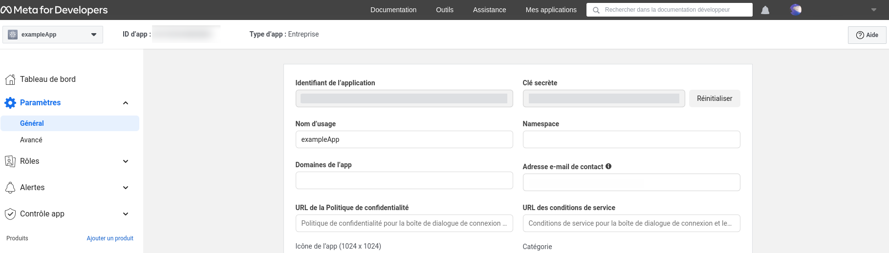
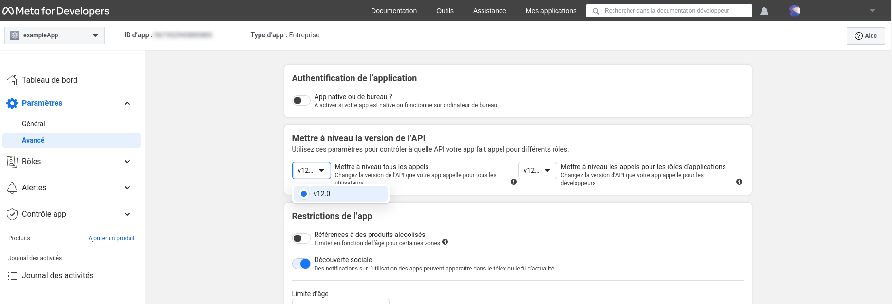
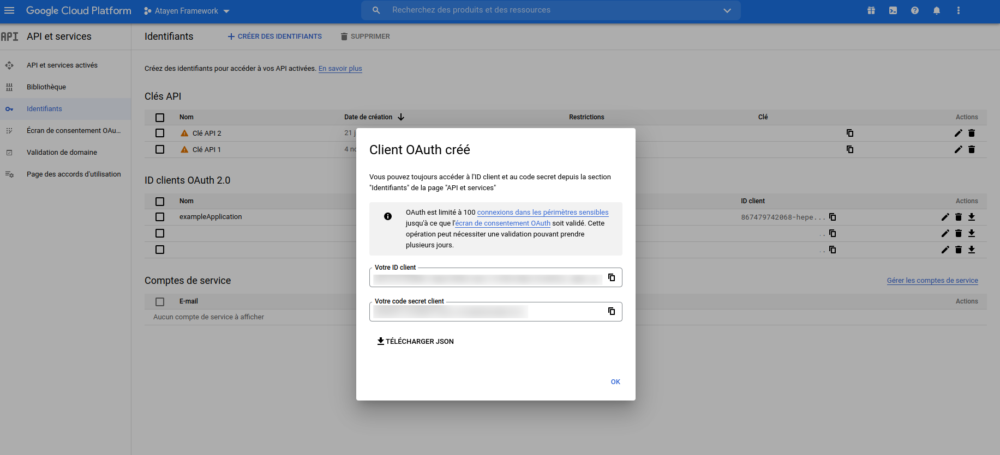
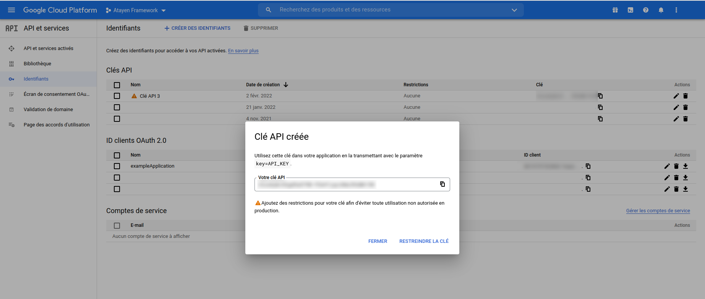
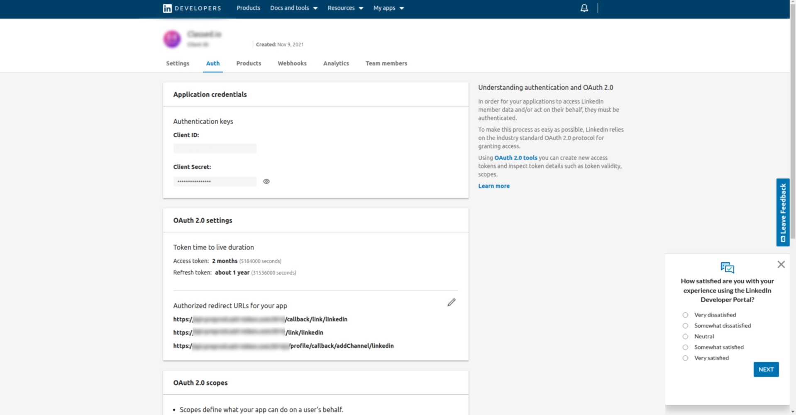
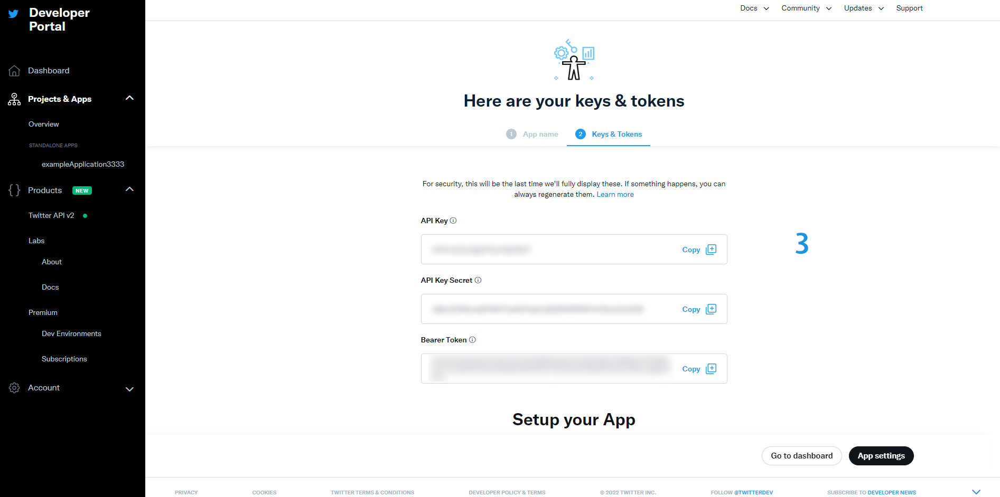
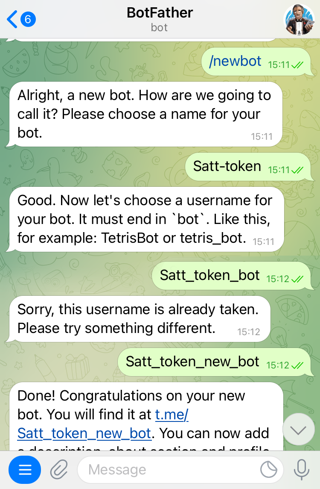

# Social networks Configuration

<!--Facebook-->

## Facebook configuration

To create a Facebook app you should visit [official developer.facebook.com website](https://developers.facebook.com/apps/) and respect the following steps:

### 1. Create an app


### 2. Confirm app creation


### 3. Get Facebook credentials



### 4. Get Facebook version



PS:
All this credentials refers to APPID,APP_SECRET,FB_GRAPH_VERSION in .env file

```sh
APPID=process.env.APPID
APP_SECRET=process.env.APP_SECRET
FB_GRAPH_VERSION=process.env.FB_GRAPH_VERSION
```

<!--Google-->

## Google configuration

To create a google app you should visit [official console.developers.google.com website](https://console.developers.google.com/) and respect the following steps:

### 1. Create Credentialds


### 2. Fill out the form


### 3. Get Client crededentials



<!--Youtube-->

## Youtube configuration

In order to access the API, you'll need to get a [service key](https://developers.google.com/youtube/registering_an_application#Create_API_Keys) from the [Google Cloud Console](https://console.cloud.google.com).


## Get Youtube credentials



PS:
All this credentials refers to GOOGLE_CLIENTID,GOOGLE_CLIENT_SECRET and GDA_TAP_API_KEY in .env file

```sh
GOOGLE_CLIENTID=process.env.GOOGLE_CLIENTID
GOOGLE_CLIENT_SECRET=process.env.GOOGLE_CLIENT_SECRET
GDA_TAP_API_KEY= process.env.GDA_TAP_API_KEY
```

<!--Linkedin-->

## LinkedIN configuration

To create a linkedin app you should visit [official developer.linkedin.com website](https://developer.linkedin.com/) and respect the following steps:

### 1. Create a new app


### 2. Get linkedin crededentials



PS:
All this credentials refers to LINKEDIN_KEY and LINKEDIN_SECRET in .env file

```sh
LINKEDIN_KEY=process.env.LINKEDIN_KEY
LINKEDIN_SECRET=process.env.LINKEDIN_SECRET
```

<!--Twitter-->

## Twitter configuration

To create a linkedin app you should visit [official developers.twitter.com website](https://developer.twitter.com/) and respect the following steps:

### 1. Create a new app


### 2. Set params for your app


### 3. Get your twitter credentialds



# Regenrate your twitter credentialds

you can regenerate again your credentials with more options


PS:
All this credentials refers to TWITTER_CONSUMER_KEY_ALT, TWILTTER_CONSUMER_SECRET_ALT,TWITTER_CONSUMER_SECRET_DEV,TWITTER_CONSUMER_KEY
TWITTER_CONSUMER_SECRET,TWITTER_ACCESS_TOKEN_KEY and TWITTER_ACCESS_TOKEN_SECRET in .env file

```sh
TWITTER_CONSUMER_KEY_ALT=process.env.TWITTER_CONSUMER_KEY_ALT
TWILTTER_CONSUMER_SECRET_ALT=process.env.TWILTTER_CONSUMER_SECRET_ALT
TWITTER_CONSUMER_SECRET_DEV=process.env.TWITTER_CONSUMER_SECRET_DEV
TWITTER_CONSUMER_KEY=process.env.TWITTER_CONSUMER_KEY
TWITTER_CONSUMER_SECRET=process.env.TWITTER_CONSUMER_SECRET
TWITTER_ACCESS_TOKEN_KEY=process.env.TWITTER_ACCESS_TOKEN_KEY
TWITTER_ACCESS_TOKEN_SECRET=process.env.TWITTER_ACCESS_TOKEN_SECRET
```

<!--Telegram-->

## Telegram configuration

To create a Telegram bot you should set it via mobile Telegram application:

### 1. BotFather



### 2. Get your confirmation


PS:
This credential refer to TELEGRAM_BOT_TOKEN in .env file

```sh
TELEGRAM_BOT_TOKEN=process.env.TELEGRAM_BOT_TOKEN

```

<!--CoinMarketcap-->

## CoinMarketCap configuration

We get data refer to SaTT token from [official coinmarketcap.com/api website](https://coinmarketcap.com/api/) and respect the following steps:

### 1. Create your account


### 2. Get your crededentials


PS:
All this credentials refers to CMR_URL and CMCAPIKEY in .env file

```sh
CMR_URL=process.env.CMR_URL
CMCAPIKEY=process.env.CMCAPIKEY
```
